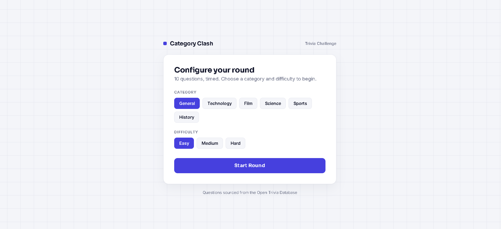

# Category Clash

**A fast-paced trivia quiz game built with vanilla JavaScript.** Pick a category, race a timed countdown per question, and walk away with a scored results screen.

[Live Demo](https://category-clash-quiz.vercel.app/) · [Report Bug](https://github.com/Arpithaapoojary/category-clash/issues) · [Request Feature](https://github.com/Arpithaapoojary/category-clash/issues)

<p align="center">
  
</p>

---

## Overview

Category Clash is a single-page trivia game that fetches live questions from a public trivia API and turns them into a timed quiz with instant visual feedback. It's built entirely with HTML, CSS, and JavaScript — no frameworks, no build tools, no backend. Clone it and open the file, and it runs.

The project was built to explore live API integration, timed UI interactions, and state management in plain JavaScript without relying on a framework to handle it.

---

## Features

- **6 categories** — General Knowledge, Tech, Movies, Science, Sports, History
- **3 difficulty levels** — Easy, Medium, Hard
- **Live questions** — pulled fresh from the Open Trivia Database on every playthrough
- **15-second timer per question** with an animated countdown bar
- **Instant answer feedback** — correct/incorrect states highlighted before advancing
- **Ticket-stub scorecard** — a styled results screen that ranks your performance
- **Zero dependencies** — pure HTML/CSS/JS, no npm install required
- **Fully responsive** — playable on mobile and desktop

---

## Tech Stack

| Layer      | Technology                          |
|------------|--------------------------------------|
| Structure  | HTML5                                |
| Styling    | CSS3 (custom properties, no framework) |
| Logic      | Vanilla JavaScript (ES6+)            |
| Data       | [Open Trivia Database](https://opentdb.com) REST API |
| Fonts      | Google Fonts (Bungee, Space Grotesk, JetBrains Mono) |

---

## Getting Started

### Prerequisites

- Any modern web browser
- No Node.js, npm, or build tools required

### Installation

```bash
git clone https://github.com/Arpithaapoojary/category-clash.git
cd category-clash
```

Then simply open `index.html` in your browser — or serve it locally:

```bash
# Using Python
python3 -m http.server 8000

# Or using the VS Code "Live Server" extension
```

Visit `http://localhost:8000` in your browser.

---

## How It Works

1. **Setup screen** — choose a category and difficulty level.
2. On start, the app calls the Open Trivia DB API:
   ```
   GET https://opentdb.com/api.php?amount=10&category={id}&difficulty={level}&type=multiple
   ```
3. Questions and answers are decoded (the API returns HTML-encoded text) and answer order is shuffled client-side.
4. Each question has a 15-second timer. Answering — or running out of time — locks in the response and reveals the correct answer before advancing.
5. After 10 questions, a final "ticket" screen displays the score and a performance rank.

---

## Project Structure

```
category-clash/
└── index.html    # All markup, styles, and logic in a single file
```

The project is intentionally kept as a single file to stay dependency-free and instantly runnable — ideal for quick deployment or code review.

---

## Deployment

This is a static site, so it can be deployed anywhere that serves static files:

**GitHub Pages**
1. Go to **Settings → Pages** in this repository
2. Set source to the `main` branch, root folder
3. Your game will be live at `https://arpithaapoojary.github.io/category-clash/`

**Netlify / Vercel**
- Drag and drop the folder, or connect the repo — no build command needed.

---

## Roadmap

- [ ] Persist high scores with `localStorage`
- [ ] Add a global leaderboard (would require a lightweight backend)
- [ ] Sound effects for correct/incorrect answers
- [ ] Multiplayer "clash" mode — two players race the same question set
- [ ] Dark/light theme toggle

---

## Credits

Questions provided by the [Open Trivia Database](https://opentdb.com), a free, community-maintained trivia API.

---

Built by [Arpitha Poojary](https://github.com/Arpithaapoojary) — if you found this useful, consider leaving a star.
